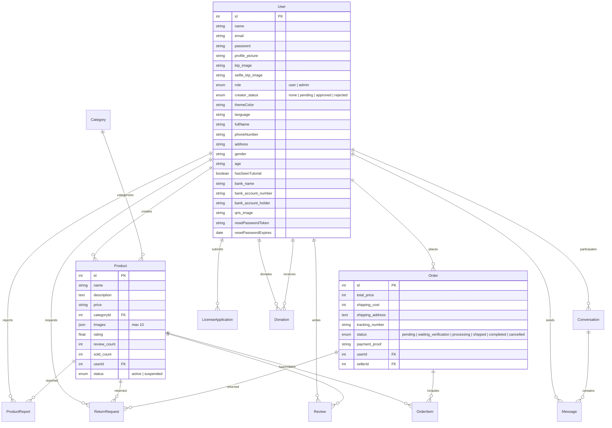

# 🌱 RUPA — Rumah Produk Anak Bangsa

<div align="center">

**Platform Marketplace & Conversational Commerce untuk UMKM dan Kreator Lokal Indonesia**

🌐 [terasrupa.com](https://terasrupa.com) &nbsp;|&nbsp; API: `api.terasrupa.com`


</div>

---

## 📖 Tentang Proyek

**RUPA** adalah platform marketplace yang memfasilitasi jual-beli karya kreatif, pengajuan lisensi produk, donasi untuk kreator, serta interaksi langsung antara penjual dan pembeli melalui fitur **Conversational Commerce** (chat realtime dengan invoice terintegrasi).

Platform ini dirancang untuk mendukung ekosistem kreatif Indonesia — mulai dari produk daur ulang, kerajinan tangan, fashion, teknologi, hingga produk organik dari talenta muda Indonesia.

---

## 🚀 Fitur Utama

### 👤 Sisi Pengguna (User)
| Fitur | Deskripsi |
|-------|-----------|
| **Marketplace** | Jelajahi, cari, dan filter produk berdasarkan kategori, harga, dan popularitas |
| **Conversational Commerce** | Chat langsung dengan penjual, kirim permintaan beli, terima invoice, dan upload bukti pembayaran — semua di dalam ruang chat |
| **Keranjang Belanja** | Tambah produk ke keranjang dengan ringkasan pesanan lengkap |
| **Manajemen Pesanan** | Lacak status pesanan (Pending → Verifikasi → Proses → Kirim → Selesai) |
| **Sistem Review** | Beri rating dan ulasan untuk produk yang sudah dibeli |
| **Pengajuan Retur** | Ajukan retur dengan upload bukti video unboxing dan foto (refund/ganti produk) |
| **Profil Kreator** | Halaman profil publik kreator dengan daftar produk dan statistik |
| **Pengajuan Kreator (KYC)** | Daftar sebagai kreator dengan verifikasi KTP dan selfie |
| **Upload Produk** | Kreator dapat upload hingga 10 foto per produk |
| **Lisensi Karya** | Ajukan lisensi karya (Komersial, Non-Komersial, Pendidikan, Pemerintah) |
| **Donasi Kreator** | Dukung kreator favorit dengan donasi dan pesan dukungan |
| **Informasi Pembayaran** | Kreator dapat menyimpan info rekening bank dan QRIS |
| **Dynamic Themes** | 5 pilihan tema warna (Green, Orange, Blue, Purple, Pink) tersimpan di profil |
| **Multi-Bahasa** | Dukungan 5 bahasa: Indonesia, English, 中文, 日本語, 한국어 |
| **Onboarding Tutorial** | Tutorial interaktif untuk pengguna baru |
| **Guest Mode** | Jelajahi marketplace tanpa login |

### 🛡️ Sisi Admin
| Fitur | Deskripsi |
|-------|-----------|
| **Dashboard Overview** | Statistik sistem (total user, produk, pesanan, pendapatan) |
| **Analytics** | Grafik transaksi harian, top kreator, dan produk terlaris per kategori |
| **Verifikasi Kreator** | Approve/reject pengajuan kreator dengan review dokumen KYC |
| **Manajemen Kategori** | CRUD kategori produk |
| **Manajemen Lisensi** | Review dan approve/reject pengajuan lisensi |
| **Manajemen Donasi** | Verifikasi bukti donasi, approve, dan distribusi dana |
| **Laporan Produk** | Tinjau laporan pelanggaran produk dan suspend/aktifkan produk |
| **Manajemen Retur** | Review, approve, proses, dan selesaikan pengajuan retur |
| **Manajemen Admin** | Buat admin baru dan kirim reset password via email |

### ⚙️ Fitur Teknis
- **Auto-Cancel System** — Pembatalan otomatis pesanan pending yang tidak dibayar dalam 24 jam
- **JWT Authentication** — Login aman dengan token-based auth
- **Google OAuth** — Login cepat dengan akun Google
- **Password Reset** — Reset password via email (Nodemailer + Gmail SMTP)
- **Cloudinary Integration** — Hosting gambar produk, profil, bukti pembayaran, dan QRIS
- **Lazy Loading** — Code-splitting komponen dengan `React.lazy` dan `Suspense`
- **Scroll Restoration** — Auto scroll-to-top saat navigasi antar halaman
- **Axios Interceptors** — Auto-attach token dan handle error 401 secara global

---

## 🛠️ Tech Stack

### Frontend
| Teknologi | Versi | Fungsi |
|-----------|-------|--------|
| React | 19 | UI Library |
| Vite | 8 | Build Tool & Dev Server |
| TypeScript | 6 | Type Safety |
| Tailwind CSS | 4 | Utility-first Styling |
| Shadcn/UI (Radix) | Latest | Komponen UI (Dialog, Select, Tabs, dll) |
| Lucide React | 1.8 | Icon Library |
| Axios | 1.15 | HTTP Client |
| React Router DOM | 7 | Client-side Routing |
| Recharts | 3.8 | Grafik & Charting (Admin Analytics) |
| Embla Carousel | 8.6 | Image Slider Produk |
| Sonner | 2.0 | Toast Notifications |
| React Hook Form | 7 | Form Management |
| Supabase JS | 2.49 | Supabase Client |

### Backend
| Teknologi | Versi | Fungsi |
|-----------|-------|--------|
| Node.js | 14+ | Runtime |
| Express | 5 | Web Framework |
| Sequelize | 6 | MySQL ORM |
| MySQL2 | 3.22 | Database Driver |
| Cloudinary | 1.41 | Image Hosting & CDN |
| JSON Web Token | 9 | Autentikasi |
| Google Auth Library | 10 | Google OAuth |
| Bcrypt | 6 | Password Hashing |
| Multer | 2.1 | File Upload Handler |
| Nodemailer | 8 | Email Service (SMTP) |
| Nodemon | 3.1 | Dev Hot-reload |

---

## 📂 Struktur Proyek

```text
RUPA WEB/
├── frontend/                    # Aplikasi React (Client)
│   ├── App.tsx                  # Root component & routing
│   ├── main.tsx                 # Entry point
│   ├── index.html               # HTML template
│   ├── vite.config.ts           # Konfigurasi Vite + Tailwind
│   ├── components/
│   │   ├── LoginPage.tsx        # Halaman login (email + Google OAuth)
│   │   ├── SignUpPage.tsx       # Halaman registrasi
│   │   ├── ResetPasswordPage.tsx # Reset password via token
│   │   ├── UserDashboard.tsx    # Dashboard utama user (navigasi + state)
│   │   ├── AdminDashboard.tsx   # Dashboard admin
│   │   ├── AdminLoginPage.tsx   # Login khusus admin
│   │   ├── user/                # Halaman-halaman user
│   │   │   ├── HomePage.tsx         # Beranda & produk unggulan
│   │   │   ├── SearchPage.tsx       # Pencarian & filter produk
│   │   │   ├── ProductDetailPage.tsx # Detail produk + image slider
│   │   │   ├── CartPage.tsx         # Keranjang belanja
│   │   │   ├── OrdersPage.tsx       # Manajemen pesanan (buyer + seller)
│   │   │   ├── ChatListPage.tsx     # Daftar percakapan
│   │   │   ├── ChatRoomPage.tsx     # Ruang chat + invoice system
│   │   │   ├── ProfilePage.tsx      # Profil & tema
│   │   │   ├── SettingsPage.tsx     # Pengaturan akun & bahasa
│   │   │   ├── UploadPage.tsx       # Upload/edit produk
│   │   │   ├── LicensePage.tsx      # Pengajuan lisensi
│   │   │   ├── CreatorProfilePage.tsx # Profil publik kreator + donasi
│   │   │   ├── CreatorApplication.tsx # Form pengajuan kreator (KYC)
│   │   │   ├── ReturnPage.tsx       # Pengajuan & riwayat retur
│   │   │   ├── ReviewSection.tsx    # Komponen ulasan produk
│   │   │   ├── OnboardingTutorial.tsx # Tutorial pengguna baru
│   │   │   └── UserFooter.tsx       # Footer aplikasi
│   │   ├── admin/               # Halaman-halaman admin
│   │   │   ├── AdminOverview.tsx    # Statistik dashboard
│   │   │   ├── AdminAnalytics.tsx   # Grafik & analitik
│   │   │   ├── AdminUsers.tsx       # Verifikasi kreator & manage admin
│   │   │   ├── AdminCategories.tsx  # CRUD kategori
│   │   │   ├── AdminLicenses.tsx    # Review lisensi
│   │   │   ├── AdminDonations.tsx   # Verifikasi donasi
│   │   │   ├── AdminReports.tsx     # Laporan produk
│   │   │   └── AdminReturns.tsx     # Manajemen retur
│   │   ├── figma/               # Komponen shared
│   │   │   └── ImageWithFallback.tsx # Image loader + fallback
│   │   └── ui/                  # 49 komponen Shadcn/UI (Radix-based)
│   ├── contexts/
│   │   └── AuthContext.tsx      # Global auth state & user management
│   ├── hooks/
│   │   └── useAuth.ts           # Custom hook untuk AuthContext
│   ├── types/
│   │   ├── index.ts             # Type definitions (User, Product, Cart, Chat)
│   │   └── orders.ts            # Order type definitions
│   ├── utils/
│   │   ├── api.ts               # Axios instance + interceptors
│   │   ├── apiServices.ts       # Semua API service functions
│   │   ├── cloudinaryUrl.ts     # Cloudinary URL helper
│   │   ├── currency.ts          # Format mata uang Rupiah
│   │   ├── supabaseClient.ts    # Supabase client config
│   │   └── translations.ts     # 2300+ baris terjemahan (5 bahasa)
│   ├── data/
│   │   └── constants.ts         # Theme color definitions
│   └── styles/
│       └── globals.css          # Global CSS & Tailwind base
│
├── backend/                     # API Server (Node.js)
│   ├── server.js                # Entry point, middleware, dan route mounting
│   ├── config/
│   │   ├── database.js          # Koneksi Sequelize → MySQL
│   │   ├── cloudinaryConfig.js  # Cloudinary setup + Multer storage
│   │   └── config.json          # Sequelize CLI config
│   ├── middleware/
│   │   └── authMiddleware.js    # verifyToken, isAdmin, isApprovedCreator
│   ├── models/                  # 12 Sequelize Models
│   │   ├── User.js              # User (role, KYC, theme, payment info)
│   │   ├── Product.js           # Product (multi-image, rating, status)
│   │   ├── Category.js          # Kategori produk
│   │   ├── Order.js             # Pesanan (shipping, tracking, status)
│   │   ├── OrderItem.js         # Item dalam pesanan
│   │   ├── Conversation.js      # Percakapan chat
│   │   ├── Message.js           # Pesan chat (text/purchase_request/invoice)
│   │   ├── Review.js            # Ulasan & rating produk
│   │   ├── LicenseApplication.js # Pengajuan lisensi karya
│   │   ├── Donation.js          # Donasi (donor → kreator, status, bukti)
│   │   ├── ProductReport.js     # Laporan pelanggaran produk
│   │   └── ReturnRequest.js     # Pengajuan retur (refund/replacement)
│   ├── controllers/             # 12 Controllers (business logic)
│   ├── routes/                  # 12 Route files
│   ├── seeders/                 # Data awal
│   │   ├── 20260417142412-demo-categories.js
│   │   └── 20260417150438-inject-admin.js
│   └── package.json
│
├── .gitignore
└── README.md
```

---

## 🔌 API Endpoints

### Auth (`/api/auth`)
| Method | Endpoint | Deskripsi |
|--------|----------|-----------|
| POST | `/register` | Registrasi user baru |
| POST | `/login` | Login (email + password) |
| POST | `/google-login` | Login via Google OAuth |
| POST | `/forgot-password` | Kirim email reset password |
| POST | `/reset-password/:token` | Reset password dengan token |

### Users (`/api/users`)
| Method | Endpoint | Deskripsi |
|--------|----------|-----------|
| GET | `/profile` | Ambil profil user (auth) |
| PUT | `/profile` | Update profil & foto (auth) |
| PUT | `/change-password` | Ubah password (auth) |
| POST | `/apply-creator` | Ajukan status kreator + KYC (auth) |
| GET | `/:id/payment-info` | Info pembayaran kreator (publik) |

### Products (`/api/products`)
| Method | Endpoint | Deskripsi |
|--------|----------|-----------|
| GET | `/` | Daftar semua produk (+ query params filter) |
| GET | `/:id` | Detail produk by ID |
| GET | `/my-products` | Produk milik user login (auth) |
| GET | `/user/:userId` | Produk by user ID |
| POST | `/` | Upload produk baru (kreator) |
| PUT | `/:id` | Update produk (kreator) |
| DELETE | `/:id` | Hapus produk (kreator) |

### Categories (`/api/categories`)
| Method | Endpoint | Deskripsi |
|--------|----------|-----------|
| GET | `/` | Daftar semua kategori |

### Orders (`/api/orders`)
| Method | Endpoint | Deskripsi |
|--------|----------|-----------|
| POST | `/invoice` | Buat invoice dari chat (seller) |
| GET | `/my-orders` | Pesanan sebagai buyer (auth) |
| GET | `/received-orders` | Pesanan diterima sebagai seller (auth) |
| PUT | `/confirm/:id` | Upload bukti bayar (buyer) |
| PUT | `/verify/:id` | Verifikasi pembayaran (seller) |
| PUT | `/ship/:id` | Input resi pengiriman (seller) |
| PUT | `/complete/:id` | Konfirmasi pesanan selesai (buyer) |

### Chat (`/api/chats`)
| Method | Endpoint | Deskripsi |
|--------|----------|-----------|
| GET | `/` | Daftar percakapan (auth) |
| POST | `/start` | Mulai chat baru dari produk |
| GET | `/:conversationId` | Ambil pesan dalam percakapan |
| POST | `/:conversationId/message` | Kirim pesan (text/purchase_request/invoice) |

### Reviews (`/api/reviews`)
| Method | Endpoint | Deskripsi |
|--------|----------|-----------|
| POST | `/` | Buat review untuk produk (auth) |
| GET | `/product/:productId` | Review untuk produk tertentu |

### Licenses (`/api/licenses`)
| Method | Endpoint | Deskripsi |
|--------|----------|-----------|
| POST | `/submit` | Ajukan lisensi karya (auth) |
| GET | `/my-licenses` | Lisensi yang diajukan user (auth) |

### Donations (`/api/donations`)
| Method | Endpoint | Deskripsi |
|--------|----------|-----------|
| POST | `/` | Buat donasi baru (auth) |
| GET | `/my-donations` | Riwayat donasi user (auth) |
| PUT | `/:id/proof` | Upload bukti transfer donasi (auth) |

### Returns (`/api/returns`)
| Method | Endpoint | Deskripsi |
|--------|----------|-----------|
| POST | `/` | Ajukan retur produk (auth) |
| GET | `/my-returns` | Riwayat retur user (auth) |

### Reports (`/api/reports`)
| Method | Endpoint | Deskripsi |
|--------|----------|-----------|
| POST | `/products/:id` | Laporkan produk (auth) |

### Admin (`/api/admin`)
| Method | Endpoint | Deskripsi |
|--------|----------|-----------|
| GET | `/stats` | Statistik sistem |
| GET | `/analytics/daily` | Transaksi harian |
| GET | `/analytics/creators` | Top kreator |
| GET | `/analytics/products` | Produk terlaris per kategori |
| GET | `/admins` | Daftar admin |
| POST | `/admins` | Buat admin baru |
| POST | `/admins/:id/password-reset` | Kirim reset password admin |
| GET | `/creators/pending` | Kreator pending verifikasi |
| PUT | `/creators/verify/:userId` | Approve/reject kreator |
| POST | `/categories` | Buat kategori baru |
| PUT | `/categories/:id` | Update kategori |
| DELETE | `/categories/:id` | Hapus kategori |
| GET | `/licenses/pending` | Lisensi pending |
| PUT | `/licenses/verify/:id` | Approve/reject lisensi |
| GET | `/donations` | Daftar donasi (filter by status) |
| GET | `/donations/stats` | Statistik donasi |
| PUT | `/donations/:id` | Review donasi |
| GET | `/reports/products` | Laporan produk |
| PUT | `/reports/products/:id` | Review laporan produk |
| GET | `/returns` | Daftar retur (filter by status) |
| PUT | `/returns/:id` | Review retur |

---

## 🗄️ Database Schema (ERD)



---

## ⚙️ Persiapan & Instalasi

### 1. Prasyarat
- **Node.js** v14 atau lebih baru
- **MySQL Server** (XAMPP, Laragon, atau standalone)
- Akun **Cloudinary** (gratis) untuk hosting gambar
- Akun **Google Cloud Console** untuk OAuth (opsional)
- **Gmail App Password** untuk fitur email (opsional)

### 2. Clone Repository
```bash
git clone https://github.com/your-username/rupa-web.git
cd rupa-web
```

### 3. Setup Backend
```bash
cd backend
npm install
```

Buat file `.env` di folder `backend/`:
```env
PORT=5000
DB_NAME=rupa_db
DB_USER=root
DB_PASSWORD=
DB_HOST=localhost

JWT_SECRET=rahasia_jwt_anda_yang_kuat

CLOUDINARY_CLOUD_NAME=your_cloud_name
CLOUDINARY_API_KEY=your_api_key
CLOUDINARY_API_SECRET=your_api_secret

GOOGLE_CLIENT_ID=your_google_client_id

# Untuk fitur email (reset password & admin invitation)
SMTP_HOST=smtp.gmail.com
SMTP_PORT=587
SMTP_USER=your_email@gmail.com
SMTP_PASS=your_gmail_app_password
SMTP_FROM=RUPA Platform <your_email@gmail.com>

# URL Frontend (untuk link di email)
FRONTEND_URL=http://localhost:5173
```

### 4. Inisialisasi Database
Tabel akan dibuat **otomatis** saat server pertama kali dijalankan (`sequelize.sync({ alter: true })`).

Untuk mengisi data awal (Admin default & Kategori):
```bash
# Jalankan semua seeder
npm run seed

# Atau spesifik satu file:
npx sequelize-cli db:seed --seed 20260417150438-inject-admin.js
npx sequelize-cli db:seed --seed 20260417142412-demo-categories.js
```

Untuk membatalkan seeder:
```bash
npm run seed:undo
```

### 5. Jalankan Backend
```bash
npm run dev      # Development (nodemon hot-reload)
npm start        # Production
```
Server berjalan di `http://localhost:5000`

### 6. Setup Frontend
```bash
cd frontend
npm install
```

Buat file `.env` di folder `frontend/` (opsional, jika menggunakan Supabase):
```env
VITE_SUPABASE_URL=your_supabase_url
VITE_SUPABASE_ANON_KEY=your_supabase_anon_key
```

> **Note:** Base URL API dikonfigurasi di `frontend/utils/api.ts`. Untuk development lokal, uncomment baris `http://localhost:5000/api` dan comment baris production.

### 7. Jalankan Frontend
```bash
npm run dev
```
Aplikasi berjalan di `http://localhost:5173`

---

## 🔑 Akun Demo

### Admin
| Field | Value |
|-------|-------|
| URL | `/adminlogin` |
| Email | `admin@rupa.com` |
| Password | `admin123` |

### User Biasa
Registrasi melalui halaman `/signup` atau login dengan Google OAuth.

---

## 🌐 Deployment

### Production URLs
- **Frontend**: [https://terasrupa.com](https://terasrupa.com)
- **Backend API**: [https://api.terasrupa.com](https://api.terasrupa.com)

### CORS Configuration
Backend dikonfigurasi untuk menerima request dari:
```javascript
origin: ['https://terasrupa.com', 'https://www.terasrupa.com']
```

Untuk development lokal, sesuaikan CORS di `backend/server.js`.

### Build Frontend untuk Production
```bash
cd frontend
npm run build     # Output ke frontend/dist/
npm run preview   # Preview build lokal
```

---

## 🔒 Sistem Autentikasi

```
┌─────────────┐     POST /auth/login      ┌─────────────┐
│   Client     │ ──────────────────────▶   │   Server    │
│  (React)     │                           │  (Express)  │
│              │   ◀────────────────────   │             │
│  localStorage│     { token, user }       │  JWT Sign   │
│  .setItem()  │                           │  bcrypt     │
└──────┬───────┘                           └─────────────┘
       │
       │  Setiap request berikutnya:
       │  Authorization: Bearer <token>
       │
       ▼
  Axios Interceptor (auto-attach token)
       │
       ▼
  authMiddleware.js
  ├── verifyToken()        → Cek JWT valid
  ├── isAdmin()            → Cek role === 'admin'
  └── isApprovedCreator()  → Cek creator_status === 'approved'
```

---

## 🎨 Tema & Personalisasi

Platform mendukung 5 tema warna yang tersimpan permanen di profil user:

| Tema | Primary | Preview |
|------|---------|---------|
| 🟢 Green (default) | `#16a34a` | Hijau segar |
| 🟠 Orange | `#ea580c` | Oranye hangat |
| 🔵 Blue | `#2563eb` | Biru profesional |
| 🟣 Purple | `#9333ea` | Ungu elegan |
| 🩷 Pink | `#db2777` | Pink modern |

Tema diterapkan melalui CSS custom properties (`--theme-primary`, `--theme-secondary`, `--theme-light`) di root `App.tsx`.

---

## 🌍 Dukungan Multi-Bahasa

| Kode | Bahasa |
|------|--------|
| `id` | 🇮🇩 Bahasa Indonesia (default) |
| `en` | 🇺🇸 English |
| `zh` | 🇨🇳 中文 (Chinese) |
| `ja` | 🇯🇵 日本語 (Japanese) |
| `ko` | 🇰🇷 한국어 (Korean) |

File terjemahan: `frontend/utils/translations.ts` (2300+ baris, mencakup seluruh UI).

---

## 📜 Scripts

### Backend (`backend/package.json`)
```bash
npm start        # Jalankan server (production)
npm run dev      # Jalankan dengan nodemon (development)
npm run seed     # Jalankan semua seeder
npm run seed:undo # Batalkan semua seeder
```

### Frontend (`frontend/package.json`)
```bash
npm run dev      # Jalankan dev server (Vite)
npm run build    # Build production
npm run preview  # Preview production build
```

---

## 🤝 Kontribusi

1. Fork repository ini
2. Buat branch fitur baru: `git checkout -b fitur/nama-fitur`
3. Commit perubahan: `git commit -m "Tambah fitur baru"`
4. Push ke branch: `git push origin fitur/nama-fitur`
5. Buat Pull Request

---

## 📄 Lisensi

Proyek ini dikembangkan untuk mendukung ekosistem kreatif Indonesia. (ISC License)

---

<div align="center">

> _"Karya Anak Bangsa, Untuk Indonesia."_ 🇮🇩

**RUPA** — Rumah Produk Anak Bangsa © 2026

</div>
